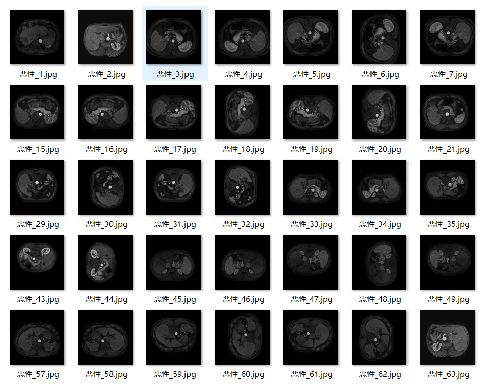
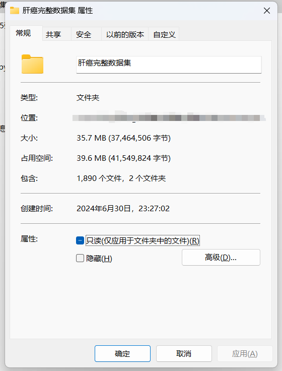
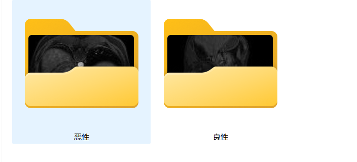
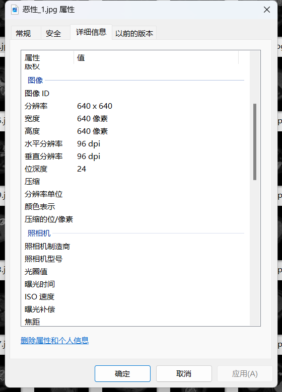

# Liver Cancer - Image Classification Dataset

Dataset Information:
- Number of images in the folder "Malignant": 1008
- Number of images in the folder "Benign": 882
- Total number of images across all subfolders: 1890

If you have any questions, just ask. There is no need for friend verification; simply send your message and I will see it.
Search me out, and answer your questions at once. I will reply to you, sometimes I am busy. If you describe your question and intention clearly, I will also respond to you.
I will also reply to you when I have free time, without any formalities, so that we can work together more efficiently.
Phone numbers are the same as above. If I forget to reply or you are impatient, you can also text or call me.

The image you've provided doesn't contain any text. If you need help with a specific task or have questions about the English language, feel free to ask!

Here is a pay link on Stripe ( https://buy.stripe.com/3cs8yP7sY87d0vu9AB ). Please contact me lonlonago@foxmail.com after funding $89, and I will send you a complete data files , thank you!

